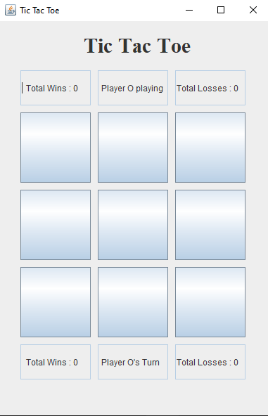
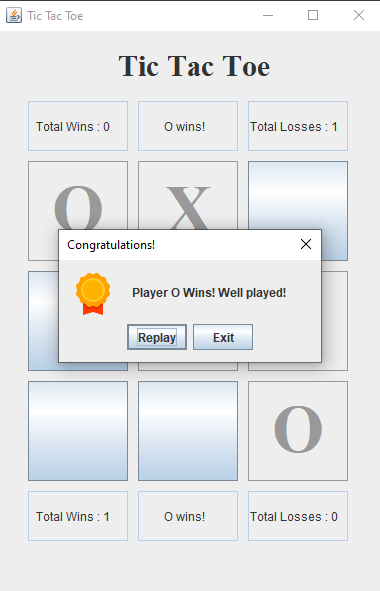

## ☕ Tic Tac Toe Using Java Swing

- A simple two-player Tic Tac Toe game built with Java Swing. Designed with a clean interface and smooth gameplay for learning and fun.

## ⚙️ Features

- Two-player mode
- Java Swing GUI
- Win/draw detection
- Reset game functionality
- Turn indicator

## 🛠️ Technologies Used

- Java
- Swing

## 📥 How to Clone

1. Clone this repository

```bash
git clone https://github.com/Rohan-Korake/Tic-Tac-Toe-Using-Java-Swing.git
```

2. To Compile

```bash
javac Tic_Tac_Toe.java
```

3. To run

```bash
java Tic_Tac_Toe
```

## 📷 Preview

 

## 📩 Connect with Me

- 📧 Email : rohannkorake@gmail.com
- 📂 GitHub : https://github.com/Rohan-Korake
- 🔗 Linkedin : https://www.linkedin.com/in/rohan-korake-720848342
